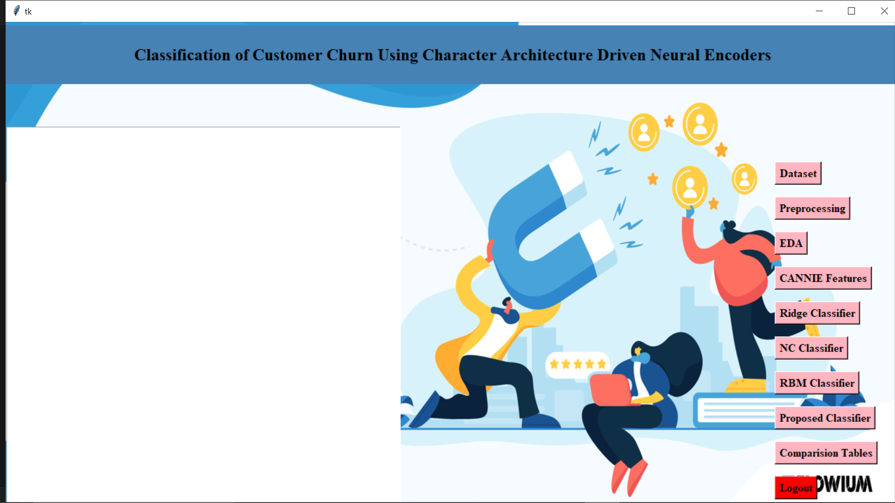

# Classification of Customer Churn Using Character Architecture Driven Neural Encoders

This project focuses on predicting customer churn using "Natural Language Processing (NLP)" techniques.
Character-level neural encoders are used to capture fine-grained textual patterns from customer-related data.
The system provides an interactive "GUI-based application" using TKinter for dataset loading and churn classification.

---

# Project Overview

Customer churn prediction is a critical task for retaining customers in business applications.
This project leverages "character-based neural architectures" to analyze customer textual data and classify churn behavior.
The application is designed with a simple GUI to make the model accessible to non-technical users.

---

## Environment Setup (Virtual Environment) 

Follow the steps below to set up the project locally.

## Create a Virtual Environment

Ensure Python 3.8 or higher is installed.

>>>python -m venv .venv

## Activate Virtual Environment

>>>.venv\Scripts\activate

## Install Required Dependencies

>>>pip install -r requirements.txt

## Dataset Information

The dataset contains customer demographic and activity-related textual data used for churn prediction.

## Project Run Command

In the root folder:

>>>python Main_GUI_NLP_LMDB.py

## Application UI

